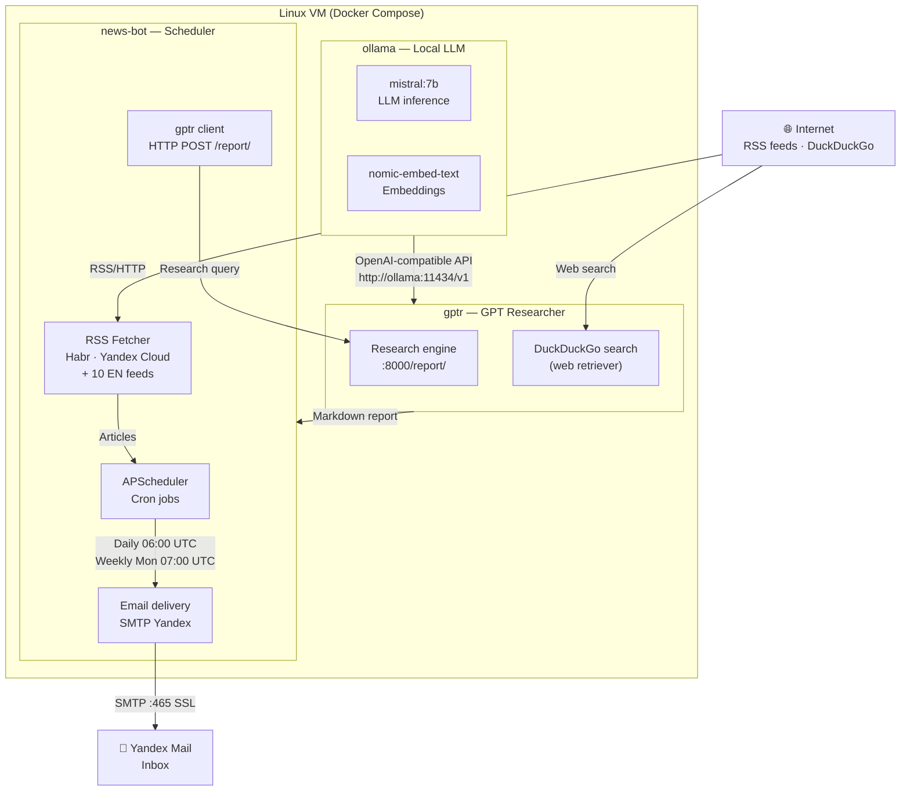

# ☸️ k8s-news-bot

Automated Kubernetes & DevOps digest bot. Runs a daily email digest and a weekly deep-research report — entirely self-hosted, no cloud AI APIs required.

**What it does:**
- **Daily digest** — fetches RSS from Habr, Yandex Cloud, Kubernetes.io, CNCF, InfoQ, AWS/GKE blogs, Prometheus, Grafana + runs an LLM-powered English research query via GPT Researcher. Delivers a combined digest to your inbox every morning.
- **Weekly report** — runs 5 focused research queries (Kubernetes releases, CNCF, managed K8s, observability, Russian-language sources) and sends a comprehensive analytical report every Monday.

All LLM inference and embeddings run locally via **Ollama** (`mistral:7b`). No OpenAI key needed.

---

## Architecture



---

## Prerequisites

| Requirement | Details |
|---|---|
| **Linux VM** | Ubuntu 22.04+, **8 vCPU / 8 GB RAM minimum** (mistral:7b needs ~5 GB RAM) |
| **Docker** | Docker Engine 24+ with Compose plugin (`docker compose`) |
| **Yandex Mail account** | For SMTP delivery (app password, not regular password) |
| **Disk** | ~10 GB free (Ollama model storage + Docker images) |

> **Note:** mistral:7b runs on CPU, but first inference after container start takes 2–4 minutes. A VM with 4+ cores is recommended for tolerable daily digest latency (typically 5–10 min end-to-end).

---

## Setup

### 1. Clone the repository

```bash
git clone https://github.com/SultankaReal/k8s-news-bot.git
cd k8s-news-bot
```

### 2. Create your `.env` file

```bash
cp .env.example .env
nano .env
```

Fill in the required values:

```env
# Your Yandex Mail address
EMAIL_FROM=your@yandex.ru

# App password (NOT your regular password!)
# Create at: https://id.yandex.ru/security/app-passwords
EMAIL_PASSWORD=your_app_password_here

# Recipient — defaults to EMAIL_FROM if not set
EMAIL_TO=your@yandex.ru
```

### 3. Install Docker (if not already installed)

```bash
# Ubuntu / Debian
curl -fsSL https://get.docker.com | sh
sudo usermod -aG docker $USER
newgrp docker
```

### 4. Start the stack

```bash
make up
# or: docker compose up -d
```

This starts three services in order:
1. **ollama** — downloads and serves `mistral:7b` (~4 GB, one-time download)
2. **gptr** — GPT Researcher web service (waits for Ollama healthcheck)
3. **news-bot** — scheduler with cron jobs (waits for gptr healthcheck)

> First startup takes **10–15 minutes** while Ollama downloads the model. Check progress with `make logs`.

### 5. Pull the Ollama model (first run)

The gptr service will automatically try to pull the model via Ollama on first use. You can also pre-pull it manually:

```bash
docker compose exec ollama ollama pull mistral:7b
docker compose exec ollama ollama pull nomic-embed-text
```

### 6. Verify the stack is running

```bash
make status
# or: docker compose ps
```

All three services should show `healthy` status.

### 7. Test a digest immediately

```bash
# Run daily digest right now (bypasses the cron schedule)
make test-daily

# Run weekly report right now
make test-weekly
```

Check your inbox within 5–10 minutes.

---

## Configuration

All settings are via environment variables in `.env`:

| Variable | Default | Description |
|---|---|---|
| `EMAIL_FROM` | — | Sender Yandex Mail address |
| `EMAIL_PASSWORD` | — | Yandex Mail app password |
| `EMAIL_TO` | `EMAIL_FROM` | Recipient address |
| `DAILY_DIGEST_CRON` | `0 6 * * *` | Daily digest schedule (UTC cron) |
| `WEEKLY_REPORT_CRON` | `0 7 * * 1` | Weekly report schedule (UTC cron) |
| `GPTR_TIMEOUT` | `900` | Max seconds to wait for GPT Researcher (LLM on CPU is slow) |
| `FAST_LLM` | `ollama:mistral:7b` | LLM for GPT Researcher fast tasks |
| `SMART_LLM` | `ollama:mistral:7b` | LLM for GPT Researcher smart tasks |
| `RETRIEVER` | `duckduckgo` | Web retriever for GPT Researcher |
| `GPTR_OUTPUTS_MAX_AGE_DAYS` | `7` | Days to keep GPT Researcher output files |
| `LOG_LEVEL` | `INFO` | Logging verbosity (`DEBUG`, `INFO`, `WARNING`) |
| `RUN_DAILY_NOW` | `0` | Set to `1` to run daily digest on container start |
| `RUN_WEEKLY_NOW` | `0` | Set to `1` to run weekly report on container start |

---

## RSS Sources

The bot fetches from 18 RSS feeds across two tracks:

**Russian sources** (included in every daily digest):
- Habr: kubernetes, devops, monitoring, cloud_computing, sys_admin, linux hubs
- Yandex Cloud blog

**English sources** (fetched for context, processed by GPT Researcher):
- kubernetes.io, cncf.io, thenewstack.io, infoq.com
- AWS Containers blog, Google Cloud / GKE blog
- devops.com, prometheus.io, grafana.com

---

## Deploy to Yandex Cloud VM

The `infra/` directory contains helpers for Yandex Cloud:

```bash
# Create a VM with cloud-init (installs Docker automatically)
yc compute instance create \
  --name k8s-news-bot \
  --zone ru-central1-a \
  --cores 8 --memory 8 \
  --create-boot-disk image-folder-id=standard-images,image-family=ubuntu-2204-lts,size=30 \
  --cloud-config infra/cloud-init.yaml \
  --ssh-key ~/.ssh/id_rsa.pub

# Deploy project files and start containers
./infra/deploy.sh
```

> Edit `infra/cloud-init.yaml` to add your own SSH public key before creating the VM.

---

## Makefile reference

```
make build        — rebuild Docker image for news-bot
make up           — start all services in background
make down         — stop all services
make logs         — tail all logs (Ctrl+C to exit)
make restart      — rebuild and recreate news-bot container
make test-daily   — run daily digest immediately
make test-weekly  — run weekly report immediately
make status       — show container status
```

---

## Project structure

```
k8s-news-bot/
├── docker-compose.yml          # Three-service stack: ollama + gptr + news-bot
├── Makefile                    # Convenience commands
├── .env.example                # Environment template
├── infra/
│   ├── cloud-init.yaml         # Yandex Cloud VM bootstrap
│   └── deploy.sh               # Deploy script (yc compute scp/ssh)
└── news-bot/
    ├── Dockerfile
    ├── requirements.txt
    └── src/
        ├── main.py             # Entry point, APScheduler setup
        ├── config.py           # Config from env vars
        ├── scheduler.py        # Job functions: daily_digest, weekly_report, cleanup
        ├── delivery/
        │   └── email.py        # Yandex SMTP delivery
        ├── fetchers/
        │   ├── __init__.py     # Article dataclass
        │   └── rss.py          # RSS/Atom fetcher (18 feeds, 8 threads)
        ├── research/
        │   └── gptr.py         # GPT Researcher HTTP client
        └── state/
            └── db.py           # SQLite state (deduplication)
```

---

## Troubleshooting

**First startup hangs at "Waiting for ollama healthy"**
- Ollama is downloading the model (~4 GB). Run `docker compose logs ollama` to see download progress.

**Daily digest runs but email is not received**
- Check `docker compose logs news-bot` for SMTP errors
- Verify `EMAIL_PASSWORD` is an **app password**, not your regular Yandex password
- Check spam folder

**GPT Researcher times out**
- Increase `GPTR_TIMEOUT` in `.env` (e.g. `1800` for 30 minutes)
- mistral:7b on CPU takes 5–15 min per research query; this is normal

**DuckDuckGo returns no results**
- DuckDuckGo rate-limits heavy usage. Wait 10–15 minutes between test runs.
- The RSS section of the digest will still be delivered even if gptr fails.

---

## License

MIT
